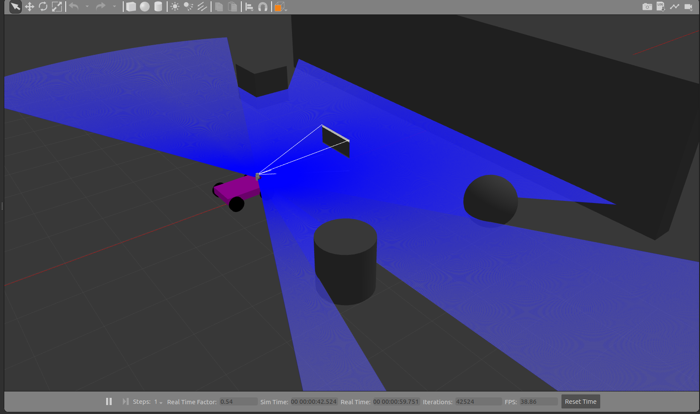
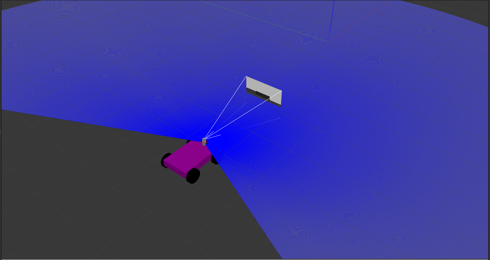
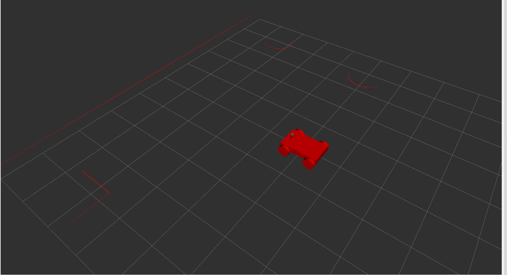

# 🤖 Mclaren – ROS 2 Differential Drive Robot Simulation

Welcome to **Mclaren_p1**, a simulated 4-wheeled differential drive robot developed using **ROS 2** and **Gazebo**. This package is ideal for exploring basic robot mobility, sensor integration, teleoperation, and obstacle detection using LiDAR.

---

## 📦 Package: `mclaren_robo`

### 🔧 Features
- 🛞 **4-Wheel Differential Drive**  
- 🔍 **10 Hz LiDAR Sensor**  
- 🎥 **30 Hz RGB Camera**  
- 🎮 **Keyboard Teleoperation** (via `teleop_twist_keyboard` and XTerm)  
- 🚨 **Wall Detection System**: Stops robot within 0.5 meters of a wall  
- 🧭 **RViz2 Visualization**  
- 🌍 **Custom Gazebo World** with lighting, gravity, and obstacles  

---

## 📁 Package Structure

### 🔩 URDF/XACRO Files
- `robot.urdf.xacro` – Main robot structure  
- `gazebo_control.xacro` – Control plugins for Gazebo  
- `shitty_bot.xacro` – Macro-based component assembly  
- `mclaren_p1.urdf` – Full robot description  

### 🌎 World File
- `Hennesey_world.world` – Includes:
  - Earth-like gravity
  - Sunlight
  - Static wall obstacle  

### 🚀 Launch Files
- smclaren_p1_launch.py`
  - Launches Gazebo with `Hennesey_world.world`
  - Spawns robot (`robot.urdf.xacro`)
  - Starts joint state publisher and robot state publisher (`shitty_bot_rsp_launch.py`)
  - Runs `wall_alert` node (`Wall_checker.cpp`)
  - Launches keyboard teleop using XTerm
  - Opens RViz2 with pre-configured layout (`mclaren_robot.rviz`)

- `mclaren_p1_rsp_launch.py`
  - Auxiliary launch file to handle robot state publishing  

### 🧠 Source Code
- `Wall_checker.cpp`
  - Custom ROS 2 node that subscribes to `/scan`
  - Stops robot if an obstacle is detected within 0.5 meters  

---
## 📸 Screenshots

### 🖼️ Overall View


### 🤖 Robot Model


### 🧱 RViz Obstacle Detection



Bear with the video quality, my system is not so strong 😅

https://github.com/user-attachments/assets/fbd3b9f3-a487-43e0-b2b4-27b28e971b82


## 🧪 How to Use

# 🚀 How to Run the `mclaren_robo` ROS 2 Package

This guide walks you through setting up and launching the **shitty_robo** ROS 2 package simulation.

---

## 📦 1. Clone the Repository

Navigate to the `src/` folder of your ROS 2 workspace and clone the repo:

```bash
git clone https://github.com/Aditya125031/mclaren_robo.git
```

## 🔧 2. Build the Workspace

Navigate to the root of your workspace and build the packages using `colcon`:

```bash
colcon build
```
## ✅ 3. Source the Workspace

Source the workspace to overlay your ROS 2 environment:

```bash
source install/setup.bash
```

## 🚀 4. Launch the Simulation

To start the complete simulation with **Ignition Gazebo**, **RViz2**, and control interfaces, run:

```bash
ros2 launch mclaren_robo mclaren_p1_launch.py
```
## 📡 Optional: Run Wall Alert Node Separately

For testing or getting clean LiDAR readings separately:

```bash
ros2 run mclaren_robo wall_alert_node
```
Subscribes to /scan

Detects walls/obstacles within 0.5 meters

Stops the robot if too close to an object  

✅ Make sure wall_alert_node is built and properly registered in your CMakeLists.txt.


## 🧪 Troubleshooting Tips

### Check that /scan is being published:

```
ros2 topic echo /scan
```

### ❌If launch fails, make sure the workspace is sourced:

```
source install/setup.bash
```

### If using a new terminal, re-source your workspace before running launch or nodes.

## Improvements you can make

You can always make the robot less -- Shitty
